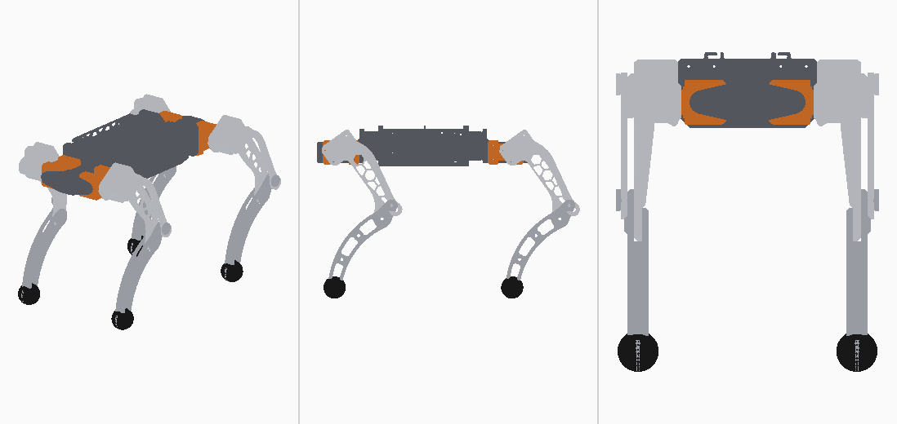

# Micro Dog

-Since the creator is Korean, the filename contains Korean.-

A 0.96 kg, 12-DOF quadruped driven by 12 × Dynamixel XL330-M288-T servos. It is built around a
Raspberry Pi Zero 2 W and uses a parallelogram four-bar knee.

This repository contains the complete mechanical design and the simulation description:
- the Autodesk Inventor source;
- a neutral STEP export;
- per-link visual meshes;
- a URDF with measured masses and joint limits;
- a flattened USD for Isaac Sim / Isaac Lab;
- the scripts that regenerate the URDF from the CAD data;
- the trained walking policy that runs on the robot (`policy/`).

[한국어 요약](README.ko.md) · [Notes from the creator](A%20small%20note%20from%20the%20creator.md)

> **Bill of materials: coming soon.** A full BOM (electronics, bearings, fasteners, printed parts
> with quantities and filament estimate) will be added in a later update.



| | |
|---|---|
| Mass | **0.960 kg** (weighed) |
| Size | 334.5 × 165.5 × 145.2 mm (assembly pose) |
| Degrees of freedom | 12: hip roll, thigh pitch, knee pitch per leg |
| Actuators | 12 × Dynamixel XL330-M288-T (Protocol 2.0) |
| Legs | thigh 95.0 mm, shank 97.0 mm, foot radius 13.0 mm |
| Hip spacing | 206.0 mm fore-aft, 58.0 mm across |
| Standing height | 0.170 m nominal |
| Compute | Raspberry Pi Zero 2 W with a Pollen Robotics RPI Robot HAT |
| Power | 2-cell lithium pack, BMS and charging module |
| Material | PLA (3D printed) for all printed parts: frame, legs, body cover; TPU-95A feet; knee pushrod links machined from 6061 aluminium in the author's build (PLA links are strong enough) |

---

## Contents

```
urdf/micro_dog.urdf        the model: 17 links, 16 joints (12 revolute + 4 fixed feet)
meshes/visual/*.stl        9 binary STLs (~19 MB), visual only; paths are relative to the URDF
step/micro_dog.step        full assembly, neutral CAD exchange (Inventor export)
usd/micro_dog.usda         pre-converted and flattened asset for Isaac Sim / Isaac Lab
params/robot_params.yaml   masses, inertias, joint origins, measured limits, actuator constants
params/*.json              raw Inventor dumps (assembly tree, mass properties) the params derive from
cad/inventor/              Autodesk Inventor 2027 source (assembly + parts)
tools/                     generate_urdf.py, derive_params.py, bake_meshes.py, stl_io.py
docs/specs.md              coordinate frames, dimensions, mass budget, knee linkage, servo zero/sign
docs/body_cover.md         the body cover, which is in the Inventor source but not in the URDF
policy/                    trained walking policy (RSL-RL checkpoint) and its deployment contract
```

**Which version is which.**
- `urdf/`, `meshes/`, `step/`, `usd/` and `params/` are the **2026-08-23 CAD export**. That is the
  version used for all simulation and training.
- `cad/inventor/` is the **current design (2026-09-21)**. It adds the body cover and small revisions
  to the foot and the Pi mount.
- The body cover is not in the simulation model. It is printed in PLA: about 50.8 g if
  solid, less with infill (see `docs/body_cover.md`).

---

## Loading the model

**Isaac Sim / Isaac Lab.** Start with `usd/micro_dog.usda`. It is already converted and flattened,
with no external references and no absolute paths.

If you convert the URDF yourself, **flatten the result**. The Isaac Sim URDF importer nests links
as a kinematic tree (`base/FL_hip/FL_thigh/...`). Isaac Lab's contact sensing assumes the flat
layout of its stock assets. In the nested layout only `base` gets `PhysxContactReportAPI`, and the
feet silently report no contacts.

**Other simulators (ROS, PyBullet, MuJoCo import, …).** Load `urdf/micro_dog.urdf`. Keep `urdf/` and
`meshes/` side by side, because meshes are referenced as `../meshes/visual/*.stl`.

Link and joint names follow the Unitree Go2 convention, so Go2 configurations need few edits:

```
base
 └ {FL,FR,RL,RR}_hip    ← *_hip_joint    revolute, axis (1,0,0)  roll
    └ *_thigh           ← *_thigh_joint  revolute, axis (0,1,0)  pitch
       └ *_calf         ← *_calf_joint   revolute, axis (0,1,0)  knee
          └ *_foot      ← *_foot_joint   fixed
```

Frame: ROS convention (+X forward, +Y left, +Z up); SI units.

## Joints

**Zero pose** is the CAD assembly pose, with every servo centred at 2048 ticks. At zero the thighs
point straight back and the shanks straight down.

| Joint | Axis | Lower (rad) | Upper (rad) |
|---|---|---:|---:|
| `*_hip_joint`, left (FL, RL) | `1 0 0` | −1.5555 | +0.8606 |
| `*_hip_joint`, right (FR, RR) | `1 0 0` | −0.8606 | +1.5555 |
| `*_thigh_joint` | `0 1 0` | −1.5278 | +0.8590 |
| `*_calf_joint` | `0 1 0` | −1.1014 | +1.2072 |

- **Limits** were measured on the assembled robot. The hip limits are mirrored between left and
  right.
- **Every revolute joint** has effort 0.6405 N·m and velocity 20.22 rad/s. These are the XL330
  values at this robot's supply voltage.
- **Joint dynamics** are damping 0.00536 and friction 0.00477.

**The knee is exact, not approximated.** The knee servo sits in the thigh and drives the shank
through a parallelogram four-bar (crank 19 mm, pushrod 95 mm). The shank angle relative to the
thigh therefore equals the servo angle 1:1. See `docs/specs.md` §3.

## Masses

| Link | Mass (kg) | ×4 |
|---|---:|---:|
| `base` | 0.45564 | — |
| `*_hip` | 0.03357 | 0.13428 |
| `*_thigh` | 0.06676 | 0.26704 |
| `*_calf` | 0.02376 | 0.09504 |
| `*_foot` | 0.00200 | 0.00800 |
| **Total** | | **0.96000** |

- The CAD sums to 912.6 g and the weighed robot is 960 g.
- The 47.4 g difference (wiring, screws, glue) is spread evenly over the four thighs and four
  calves.
- Their inertia tensors are scaled by the same ratio.

## Collision model: read this before you trust contacts

Collision uses **primitives only**: 13 boxes and 4 foot spheres of radius 0.013 m. There are no
collision meshes.

The foot sphere's lowest point matches the real foot tip (within 0.1 mm), so contact **height** is
right. The real foot is a thin blade, though, so contact **width** is about 2× too generous
laterally. For slip or contact-patch studies, model the real geometry. For gait and balance work
the sphere is fine.

## Regenerating the URDF

```
python tools/derive_params.py     # params/*.json (Inventor dumps) -> params/robot_params.yaml
python tools/generate_urdf.py     # params/robot_params.yaml       -> urdf/micro_dog.urdf
python tools/bake_meshes.py --raw <dir with raw Inventor STL exports>   # -> meshes/visual/
```

- `generate_urdf.py` reproduces `urdf/micro_dog.urdf` exactly from the shipped params (line endings follow your OS).
- The raw per-document STL exports (~240 MB) are not shipped. Export them from `cad/inventor/`.
- Requires Python 3 with `numpy` and `pyyaml`.

## Inventor source

- Open `cad/inventor/micro_dog.ipj` as the Inventor project, then `cad/inventor/전체.iam`
  ("full assembly"). The project workspace is the folder itself, so the set works from any
  location.
- The files were made with **Autodesk Inventor 2027 Education**. Inventor marks them as
  educational, and that mark stays with them if they are opened in a commercial seat.
- File names are Korean. Key terms: 다리 = leg, 몸 = body, 부품 = purchased parts, 허벅지 = thigh,
  종아리 = shank, 발 = foot, 프레임 = frame, 커버 = cover.
- **One model is not included:** `몸/시스템/Raspberry Pi Zero 2 W.ipt`. It is a third-party model.
  Download a Raspberry Pi Zero 2 W STEP model (for example from the official Raspberry Pi
  product page), import it into Inventor and save it under that name and path to restore the
  assembly. Everything else resolves inside this folder.

## Not included

- The actuator model: friction, torque–speed curve, transport delay.
- The training environment code. The walking policy and its observation/action contract are in
  `policy/`.
- IMU placement and calibration. Servo signs and IDs are in `docs/specs.md` §4. The homing offsets
  in `params/robot_params.yaml → hardware` belong to the author's unit; yours will differ.
- Bill of materials (coming soon), printing and assembly instructions.

## License

- **Hardware, documentation and the policy weights** (CAD, STEP, STL, URDF, USD, params, docs,
  policy) are licensed under
  **CC BY-NC-SA 4.0** — see [LICENSE](LICENSE).
- **Scripts in `tools/`** are licensed under **GPL-3.0-or-later** — see
  [LICENSE-SOFTWARE](LICENSE-SOFTWARE).
- Third-party components and credits: [ATTRIBUTION.md](ATTRIBUTION.md).

© 2026 moieboy9999
